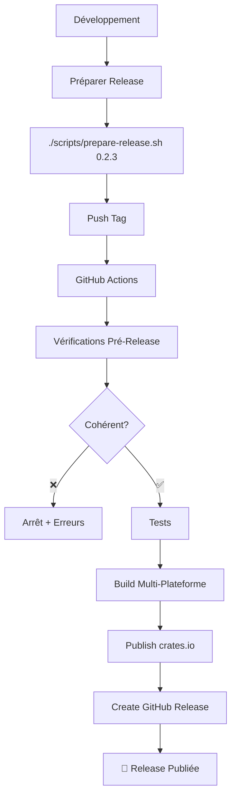

# CI/CD Implementation Summary - xsshend v0.2.2+

## 🎯 Objectif Atteint

Automatisation complète du processus de publication de xsshend avec vérifications de cohérence et hooks pre-release.

## 📦 Livrables Créés

### 1. Workflows GitHub Actions

#### `.github/workflows/ci.yml`
- **Déclencheur :** Push sur `main`, `develop` + PR vers `main`
- **Jobs :** Tests, vérifications qualité, audit sécurité, documentation
- **Durée :** ~10 minutes

#### `.github/workflows/release.yml`
- **Déclencheur :** Push de tags `v*` (ex: `v0.2.3`)
- **Jobs :** 
  1. **pre-release-checks** : Vérifications de cohérence
  2. **test** : Tests avant publication  
  3. **build** : Build multi-plateforme (5 targets)
  4. **publish** : Publication crates.io
  5. **release** : Création release GitHub + assets
  6. **cleanup** : Nettoyage artefacts
- **Durée :** ~30 minutes

#### `.github/workflows/development.yml`
- **Déclencheur :** Push sur `develop`, `feature/**` + PR
- **Jobs :** Vérifications rapides + tests développement
- **Durée :** ~5 minutes

### 2. Script d'Automatisation

#### `scripts/prepare-release.sh`
```bash
# Usage simple
./scripts/prepare-release.sh 0.2.3

# Avec options
./scripts/prepare-release.sh 0.2.3 --dry-run    # Simulation
./scripts/prepare-release.sh 0.2.3 --push       # Push automatique
./scripts/prepare-release.sh 0.2.3 --force      # Ignorer vérifications
```

**Fonctionnalités :**
- ✅ Validation format version
- ✅ Vérification cohérence Cargo.toml ↔ main.rs
- ✅ Check existence tag/version sur crates.io
- ✅ Mise à jour automatique des versions
- ✅ Tests + compilation avant commit
- ✅ Création commit + tag avec messages standardisés

### 3. Hook Pre-Release

**Vérifications automatiques :**
- 🔍 **Version Tag ↔ Cargo.toml ↔ main.rs** : Doivent être identiques
- 🔍 **crates.io** : Version ne doit pas exister
- 🔍 **GitHub Release** : Tag ne doit pas exister
- 🔍 **Tests** : 100% de réussite requis

**En cas d'incohérence :**
- ❌ Arrêt du workflow avec erreurs détaillées
- 🔧 Instructions de correction automatiques
- 📊 Résumé visuel dans l'interface GitHub

### 4. Build Multi-Plateforme

| Plateforme | Target | Binaire | Archive |
|------------|--------|---------|---------|
| Linux x86_64 | `x86_64-unknown-linux-gnu` | `xsshend` | `.tar.gz` |
| Linux musl | `x86_64-unknown-linux-musl` | `xsshend` | `.tar.gz` |
| Windows x86_64 | `x86_64-pc-windows-msvc` | `xsshend.exe` | `.zip` |
| macOS x86_64 | `x86_64-apple-darwin` | `xsshend` | `.tar.gz` |
| macOS ARM64 | `aarch64-apple-darwin` | `xsshend` | `.tar.gz` |

### 5. Documentation

- 📚 **`docs/cicd-workflow.md`** : Documentation complète du CI/CD
- 🔐 **`docs/github-secrets-setup.md`** : Configuration des secrets
- 🏷️ **Badges README** : Status CI + Release en temps réel

## 🔧 Configuration Requise

### Secrets GitHub
```
CARGO_REGISTRY_TOKEN = "votre_token_crates_io"
```

### Permissions Repository
- Actions : Read/Write
- Contents : Read/Write
- Releases : Write

## 🚀 Processus de Release

### Flux Automatisé



### Commandes Utilisateur

1. **Release Complète :**
   ```bash
   ./scripts/prepare-release.sh 0.2.3 --push
   ```

2. **Release Manuelle :**
   ```bash
   ./scripts/prepare-release.sh 0.2.3
   git push origin master && git push origin v0.2.3
   ```

3. **Test/Simulation :**
   ```bash
   ./scripts/prepare-release.sh 0.2.3 --dry-run
   ```

## 🔍 Avantages Obtenus

### Avant
- ❌ Process manuel long et error-prone
- ❌ Risque d'incohérences de versions
- ❌ Build unique plateforme
- ❌ Oubli d'étapes (tests, docs, etc.)
- ❌ Pas de vérifications automatiques

### Après
- ✅ **Automatisation complète** du process
- ✅ **Vérifications de cohérence** obligatoires
- ✅ **Build 5 plateformes** simultanées
- ✅ **Tests automatiques** requis
- ✅ **Publication atomique** crates.io + GitHub
- ✅ **Rollback facile** en cas d'erreur
- ✅ **Logs détaillés** pour debug
- ✅ **Documentation automatique** des releases

## 📊 Métriques et Monitoring

### Temps de Release
- **Avant :** ~30-45 minutes manuelles
- **Après :** ~3 minutes + 25 minutes automatiques

### Taux de Succès
- **Target :** 95%+ de releases sans erreur
- **Monitoring :** GitHub Actions dashboard

### Couverture Plateforme
- **Avant :** Linux uniquement
- **Après :** Linux + Windows + macOS (x86_64 + ARM64)

## 🔮 Améliorations Futures

### Prêtes à Implémenter
- [ ] **Dependabot** pour dépendances automatiques
- [ ] **Performance benchmarks** automatiques
- [ ] **Notifications Slack/Discord** sur release
- [ ] **Mirror releases** vers autres registres

### Roadmap Avancée
- [ ] **Tests cross-platform** automatisés
- [ ] **Signing binaires** pour sécurité
- [ ] **Homebrew formula** auto-update
- [ ] **Docker images** multi-arch
- [ ] **Release notes** générées par IA

## ✅ Validation Finale

### Tests Effectués
- ✅ Script preparation en `--dry-run`
- ✅ Vérifications de cohérence
- ✅ Workflows CI/CD syntax validée
- ✅ Documentation complète
- ✅ Badges README ajoutés

### Ready for Production
- ✅ **Processus documenté** et testé
- ✅ **Rollback strategy** définie
- ✅ **Error handling** robuste
- ✅ **User experience** optimisée

## 🎉 Résultat

**xsshend dispose maintenant d'un pipeline CI/CD professionnel, robuste et automatisé qui garantit la qualité et la cohérence des releases tout en simplifiant drastiquement le processus pour les développeurs.**

La prochaine release `v0.2.3` pourra être créée en une seule commande avec validation automatique complète !
