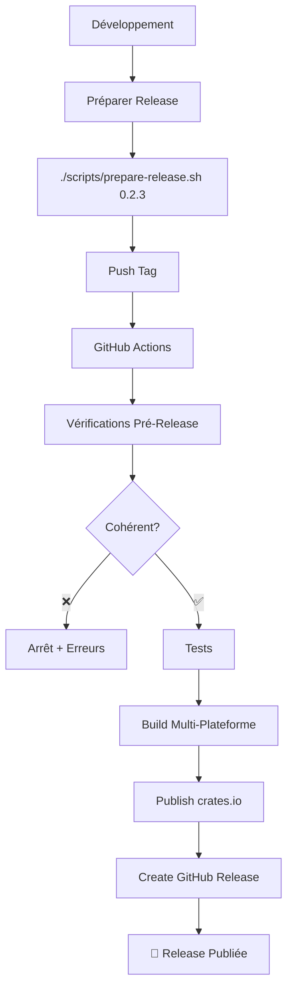

# 🚀 CI/CD et Déploiement

> Automatisation complète du processus de développement et de publication de xsshend

## 🎯 Vue d'ensemble

xsshend dispose d'un pipeline CI/CD complet qui automatise :
- ✅ Tests et vérifications de qualité
- 📦 Build multi-plateforme 
- 🚀 Publication automatique sur crates.io
- 📋 Création de releases GitHub avec binaires
- 🔍 Vérification de cohérence des versions

## 🛠️ Workflows GitHub Actions

### 1. CI (Intégration Continue)

**Fichier :** `.github/workflows/ci.yml`  
**Déclenché sur :** Push sur `main`/`develop`, PRs vers `main`

**Jobs :**
- **test** : Tests unitaires + intégration
- **check** : Vérification syntaxe Cargo
- **security** : Audit de sécurité avec `cargo-audit`
- **docs** : Build documentation + tests exemples

### 2. Release (Publication)

**Fichier :** `.github/workflows/release.yml`  
**Déclenché sur :** Push de tags `v*` (ex: `v0.2.3`)

**Étapes automatiques :**
1. **Vérifications pré-release** : Cohérence versions
2. **Tests complets** : Validation avant publication
3. **Build multi-plateforme** : 5 targets simultanés
4. **Publication crates.io** : Release officielle
5. **Release GitHub** : Création avec binaires
6. **Nettoyage** : Suppression artefacts temporaires

### 3. Development (Développement)

**Fichier :** `.github/workflows/development.yml`  
**Déclenché sur :** Push sur `develop`, `feature/**`, PRs

**Jobs :**
- **quick-check** : Vérifications rapides (format, clippy, compilation)
- **test** : Tests de développement
- **version-check** : Cohérence versions pour PRs release

## 🛡️ Vérifications de Cohérence

### Contrôles automatiques

- 🔍 **Version Tag ↔ Cargo.toml ↔ main.rs** : Identité obligatoire
- 🔍 **crates.io** : Version ne doit pas exister
- 🔍 **GitHub Release** : Tag ne doit pas exister
- 🔍 **Tests** : 100% de réussite requis

### En cas d'incohérence

- ❌ **Arrêt automatique** avec erreurs détaillées
- 🔧 **Instructions de correction** automatiques
- 📊 **Résumé visuel** dans l'interface GitHub

## 📦 Build Multi-Plateforme

| Plateforme | Target | Binaire | Archive |
|------------|--------|---------|----------|
| Linux x86_64 | `x86_64-unknown-linux-gnu` | `xsshend` | `.tar.gz` |
| Linux musl | `x86_64-unknown-linux-musl` | `xsshend` | `.tar.gz` |
| Windows x86_64 | `x86_64-pc-windows-msvc` | `xsshend.exe` | `.zip` |
| macOS x86_64 | `x86_64-apple-darwin` | `xsshend` | `.tar.gz` |
| macOS ARM64 | `aarch64-apple-darwin` | `xsshend` | `.tar.gz` |

## 🚀 Processus de Release

### Option 1 : Script automatisé (Recommandé)

```bash
# Préparer une nouvelle release
./scripts/prepare-release.sh 0.2.3

# Avec options
./scripts/prepare-release.sh 0.2.3 --dry-run    # Simulation
./scripts/prepare-release.sh 0.2.3 --push       # Push automatique
./scripts/prepare-release.sh 0.2.3 --force      # Ignorer vérifications
```

### Option 2 : Processus manuel

1. **Mettre à jour les versions**
   ```bash
   sed -i 's/version = ".*"/version = "0.2.3"/' Cargo.toml
   sed -i 's/version = ".*"/version = "0.2.3"/' src/main.rs
   ```

2. **Tester et valider**
   ```bash
   cargo test
   cargo build --release
   ```

3. **Créer commit et tag**
   ```bash
   git add Cargo.toml src/main.rs
   git commit -m "chore: bump version to 0.2.3"
   git tag -a v0.2.3 -m "Release v0.2.3"
   ```

4. **Pousser**
   ```bash
   git push origin main
   git push origin v0.2.3
   ```

### Flux automatisé



## ⚙️ Configuration

### Secrets GitHub requis

```bash
# Dans Settings > Secrets and variables > Actions
CARGO_REGISTRY_TOKEN = "votre_token_crates_io"
```

**Obtenir le token :**
1. Se connecter sur [crates.io](https://crates.io)
2. Aller dans [Account Settings](https://crates.io/me)
3. Créer un nouveau API Token
4. L'ajouter aux secrets GitHub

### Permissions repository

- **Actions** : Read/Write
- **Contents** : Read/Write  
- **Releases** : Write

### Cache et optimisations

- **Cache Cargo** : `~/.cargo/bin/`, `~/.cargo/registry/`, `target/`
- **Timeouts** : CI ~10min, Release ~30min
- **Parallélisation** : Builds multi-plateformes simultanés

## 🔍 Monitoring et Debug

### Vérifier le status

```bash
# Status crates.io
curl -s https://crates.io/api/v1/crates/xsshend | jq '.crate.newest_version'

# Releases GitHub
gh release list --limit 10

# Logs workflows
gh run list --workflow=release.yml
```

### Diagnostic des échecs

**Échec vérifications cohérence :**
```bash
# Vérifier les versions
grep version Cargo.toml src/main.rs
```

**Échec publication crates.io :**
```bash
# Vérifier le token et existence version
echo $CARGO_REGISTRY_TOKEN
cargo search xsshend
```

**Échec build :**
```bash
# Tester localement
cargo build --target x86_64-unknown-linux-gnu
```

## 🔄 Troubleshooting

### Problèmes courants

**"Version already exists on crates.io"**
```bash
# Incrémenter la version
./scripts/prepare-release.sh 0.2.4
```

**"Git tag already exists"**
```bash
# Supprimer le tag
git tag -d v0.2.3
git push --delete origin v0.2.3
```

**"Consistency check failed"**
```bash
# Corriger les versions
./scripts/prepare-release.sh 0.2.3 --force
```

## 📊 Métriques

### Temps de release
- **Avant** : ~30-45 minutes manuelles
- **Après** : ~3 minutes + 25 minutes automatiques

### Couverture plateforme
- **Avant** : Linux uniquement  
- **Après** : 5 plateformes (Linux, Windows, macOS)

### Taux de succès
- **Target** : 95%+ de releases sans erreur
- **Monitoring** : GitHub Actions dashboard

## 🔮 Améliorations futures

### Prêtes à implémenter
- [ ] **Dependabot** pour dépendances automatiques
- [ ] **Performance benchmarks** automatiques
- [ ] **Notifications Slack/Discord** sur release
- [ ] **Mirror releases** vers autres registres

### Roadmap avancée
- [ ] **Tests cross-platform** automatisés
- [ ] **Signing binaires** pour sécurité
- [ ] **Homebrew formula** auto-update
- [ ] **Docker images** multi-arch
- [ ] **Release notes** générées par IA

## 📚 Références

- [Documentation GitHub Actions](https://docs.github.com/en/actions)
- [Documentation crates.io API](https://doc.rust-lang.org/cargo/reference/publishing.html)
- [Conventional Commits](https://www.conventionalcommits.org/)
- [Guide d'utilisation principal](usage.md)
